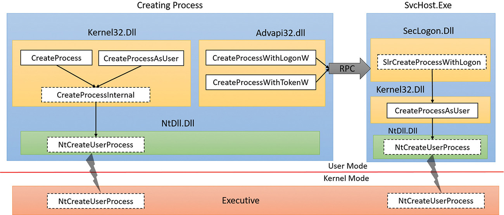
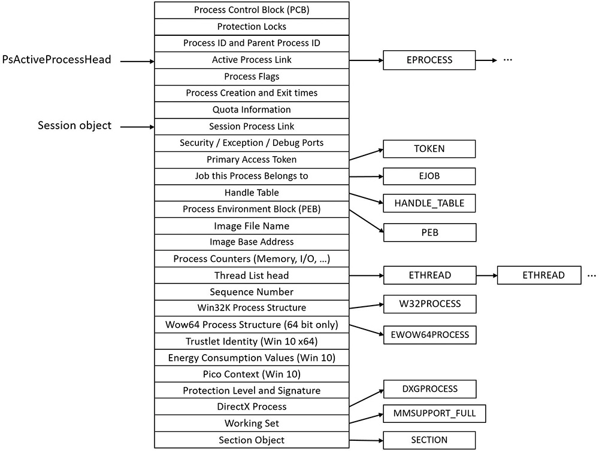
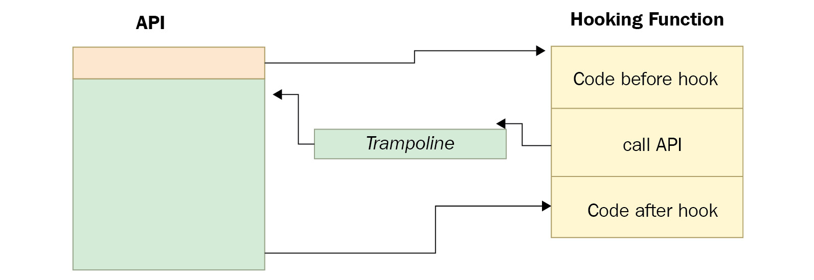
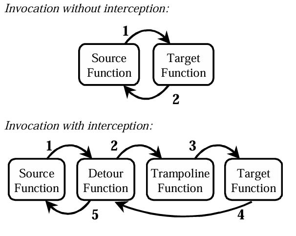
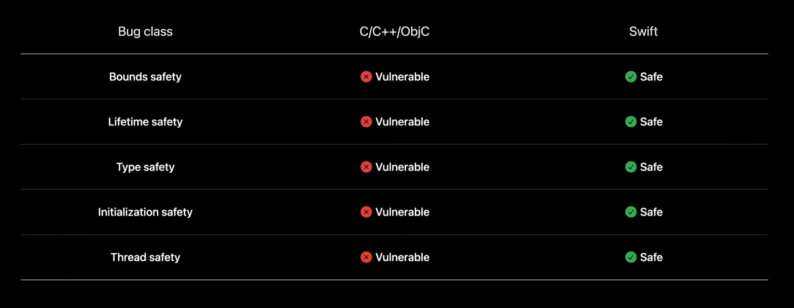
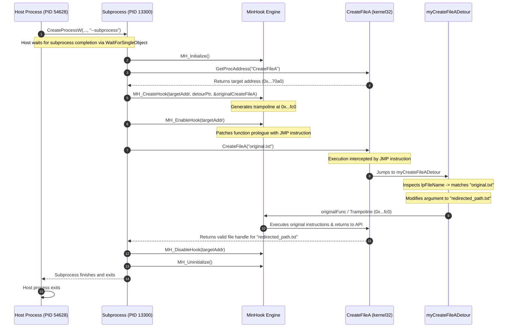

# [Swift Mentorship](https://www.swift.org/mentorship/) 2026 Demo Write-up

This demo is designed to demonstrate how Swift on Windows can be used as a path towards modernizing legacy codebases in use cases such as API-hooking.

---

### Definitions:

- **Process injection**:

  In the Windows OS, processes are allowed to allocate memory, read and write in another process’s virtual address space, as well as create new threads, suspend threads, and change these threads’ registers, including the instruction pointer register (EIP/RIP). Process injection is a group of techniques that allow you to inject code blocks or whole Dynamic-Link Libraries (DLLs) into another process’s memory, as well as execute that code. In Windows 7 and beyond, it’s not permitted to perform an injection into core Windows processes such as explorer.exe or into other users’ processes. However, it’s still OK to inject code into the current user’s browsers and other processes.

  This technique is legitimately used by multiple endpoint security products to monitor applications and for sandboxing purposes (as we will see in the Understanding API hooking section), but it’s also commonly misused by malware authors.

- **API-hooking**:

  API hooking is a common technique that’s used by malware authors to intercept calls to Windows APIs in order to change the input or output of these commands. It is based on the process injection technique that we described earlier.

  This technique allows malware authors to have full control over the target process and therefore the user experience from their interaction with that process, including browsers and website pages, antivirus applications and their scanned files, and so on. By controlling the Windows APIs, the malware authors can also capture sensitive information from the process memory and the API arguments.

  Since API hooking is used by malware authors, it has different legitimate reasons to be used, such as malware sandboxing and backward compatibility for old applications.

- **Windows API**:

  The Windows application programming interface (API) is the user-mode system programming interface to the Windows OS family. Prior to the introduction of 64-bit versions of Windows, the programming interface to the 32-bit versions of the Windows OS was called the Win32 API to distinguish it from the original 16-bit Windows API, which was the programming interface to the original 16-bit versions of Windows. In this book, the term Windows API refers to both the 32-bit and 64-bit programming interfaces to Windows.

- **Processes**:

  Although programs and processes appear similar on the surface, they are fundamentally different. A program is a static sequence of instructions, whereas a process is a container for a set of resources used when executing the instance of the program. At the highest level of abstraction, a Windows process comprises the following:
  - **A private virtual address space** This is a set of virtual memory addresses that the process can use.

  - **An executable program** This defines initial code and data and is mapped into the process’s virtual address space.

  - **A list of open handles** These map to various system resources such as semaphores, synchronization objects, and files that are accessible to all threads in the process.

  - **A security context** This is an access token that identifies the user, security groups, privileges, attributes, claims, capabilities, User Account Control (UAC) virtualization state, session, and limited user account state associated with the process, as well as the AppContainer identifier and its related sandboxing information.

  - **A process ID** This is a unique identifier, which is internally part of an identifier called a client ID.

  - **At least one thread of execution** Although an “empty” process is possible, it is (mostly) not useful.

## Creating a process:





The Windows API provides several functions for creating processes. The simplest is CreateProcess, which attempts to create a process with the same access token as the creating process.

## API-hooking

In the previous simple hooking function, the malware can alter the arguments of the API. But when you’re using trampolines, the malware can also alter the return value of the API and any data associated with it. The trampoline is simply a small function that only executes jmp to the API and includes the first missing 5 bytes (or three instructions, in the previous case), as follows:

```
trampoline:

mov edi, edi

push ebp

mov ebp, esp

jmp API+5 ; jump to the API after the first replaced 5 bytes
```

Rather than jumping back to the API, which returns control to the program in the end, the hooking function calls the trampoline as a replacement of the API. This trampoline transfers control to the actual API, but when it finishes execution, the control will be transferred back to the hooking function with the return value of the API to be altered by the hooking function before returning control back to the program, as shown in the following screenshot:



### Microsoft Detours



Detours is a software package for re-routing Win32 APIs underneath applications. For almost twenty years, has been licensed by hundreds of ISVs and used by nearly every product team at Microsoft.

## Swift on Windows

Swift is a modern language based upon the LLVM compiler framework. It takes advantage of Clang to provide seamless interoperability with C/C++. The Swift compiler and language are designed to take advantage of modern Unix facilities to the fullest, and this made porting to Windows a particularly interesting task. This talk covers the story of bringing Swift to Windows from the ground up through an unusual route: cross-compilation on Linux. The talk will cover interesting challenges in porting the Swift compiler, standard library, and core libraries that were overcome in the process of bringing Swift to a platform that challenges the Unix design assumptions.

### Write security-sensitive code in Swift

Explore how Swift guarantees safety across bounds, lifetimes, types, initialization, and concurrency. Discover high-performance primitives like Span and non-copyable types, find out how to audit unsafe constructs with Strict Memory Safety, and walk through incrementally migrating existing C modules.



# [Demo](./build_instructions.md)



# Sources:

- [Interoperability: Swift’s Super Power](https://speakinginswift.substack.com/p/interoperability-swifts-super-power?r=devo2)
- [Windows® via C/C++, 5th Edition, Chapter 22. DLL Injection and API Hooking](https://learning.oreilly.com/library/view/windows-r-via-c-c/9780735639904/)
- [Trampoline Function Generation | TsudaKageyu/minhook | DeepWiki](https://deepwiki.com/TsudaKageyu/minhook/3.3-trampoline-function-generation)

- [Porting by a 1000 Patches: Bringing Swift to Windows - Saleem Abdulrasool](https://www.youtube.com/watch?v=Zjlxa1NIfJc)
- [Windows Internals, Part 1: System architecture, processes, threads, memory management, and more, Seventh Edition - Pavel Yosifovich, Alex Ionescu, Mark E. Russinovich, David A. Solomon](https://learning.oreilly.com/library/view/windows-internals-part/9780133986471/)
- [Mastering Malware Analysis - Second Edition - Alexey Kleymenov, Amr Thabet](https://learning.oreilly.com/library/view/mastering-malware-analysis/9781803240244/)
- [Microsoft Research Detours Package - Microsoft](https://github.com/microsoft/detours)
- [Write security-sensitive code in Swift](https://developer.apple.com/videos/play/meet-with-apple/281/)
- [Computer Science from the Bottom Up - Ian Wienand](https://www.bottomupcs.com/index.html)
